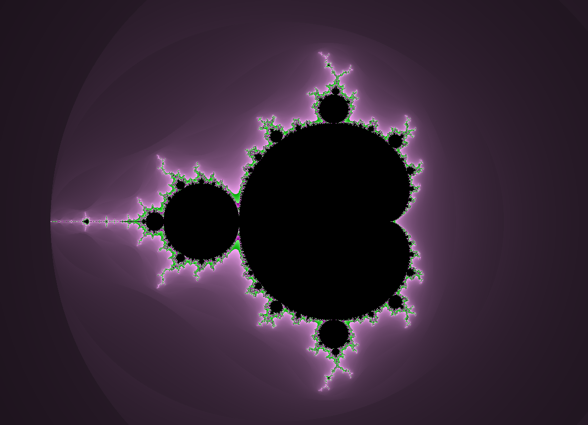

# fract-ol


**fract-ol** is a graphics project that generates and visualizes fractals using various mathematical algorithms. It allows users to explore well-known fractals like the Mandelbrot set and Julia set, with interactive controls to adjust parameters and zoom into these intricate and infinite patterns.

## Features

- Explore **Mandelbrot** and **Julia** sets.
- Interactive real-time zoom.
- Customizable fractal parameters.
- Rendered using the **minilibx** library for smooth graphics.

## Installation

### Prerequisites

Before you begin, ensure that you have the following dependencies installed:

- **MinilibX** (for graphical rendering on macOS or Linux)
- **X11** development libraries (on Linux)
- **GCC** or any C compiler
- **Make** (for compiling)

### Steps

1. Clone the repository:

    ```bash
    git clone https://github.com/AhmedHodiani/fract-ol.git
    cd fract-ol
    ```

2. Compile the project using `make`:

    ```bash
    make
    ```

3. Run the executable:

    ```bash
    ./fract-ol
    ```

4. Enjoy exploring fractals!

## Usage

- **Arrow keys**: Move the fractal.
- **Mouse scroll**: Zoom in and out.

---

Enjoy fractals and happy coding! 🌟
